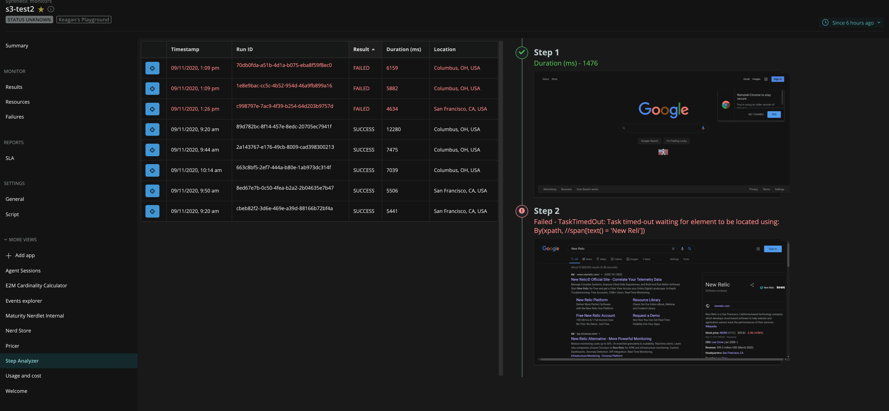

[](https://opensource.newrelic.com/oss-category/#experimental)

# Synthetics Step Analyzer

Drill into synthetic scripted monitor executions. This application allows you to explore the performance of custom defined steps within a script and provides a timeline of screenshots of those steps.

**NOTE: You must be using a custom scripted function to save synthetic screenshots to AWS S3 and the corresponding S3 bucket must be accessible from the nerdpack (see below)**



## What do you need to make this work?

* Public S3 Bucket with [CORS enabled](https://docs.aws.amazon.com/AmazonS3/latest/dev/cors.html#how-do-i-enable-cors). An example configuration can be [found here](examples/s3-cors-example.xml)
* AWS-SDK Authentication and bucket name configured within `main.js` - There are currently 2 options:
   1. [Configure an AWS Cognito Identity Pool](https://docs.aws.amazon.com/sdk-for-javascript/v2/developer-guide/loading-browser-credentials-cognito.html) [RECOMMENDED]. This is configured within the `cognitoCreds` object in `main.js`.
   2. Use your own [AWS Access/Secret keys](https://docs.aws.amazon.com/sdk-for-javascript/v2/developer-guide/getting-your-credentials.html). These are configured within the `personalCreds` object in `main.js`.
* Synthetic scripts written to use the `SaveScreenshot` function and logging step times/failures to NRDB correctly. An example script can be [found here](examples/example.js).

## Getting Started

1. Ensure that you have [Git](https://git-scm.com/book/en/v2/Getting-Started-Installing-Git) and [NPM](https://www.npmjs.com/get-npm) installed. If you're unsure whether you have one or both of them installed, run the following commands. (If you have them installed, these commands return a version number; if not, the commands won't be recognized.)
```bash
git --version
npm -v
```
2. Install the [NR1 CLI](https://one.newrelic.com/launcher/developer-center.launcher) by going to [this link](https://one.newrelic.com/launcher/developer-center.launcher) and following the instructions (5 minutes or less) to install and set up your New Relic development environment.
3. Execute the following commands to clone this repository and run the code locally against your New Relic data:

```bash
nr1 nerdpack:clone -r https://github.com/newrelic-experimental/nr1-step-analyzer.git
cd nr1-execution-analyzer
nr1 nerdpack:serve
```

Visit [https://one.newrelic.com/?nerdpacks=local](https://one.newrelic.com/?nerdpacks=local), navigate to the Nerdpack (Listed as **Step Analyzer** under any synthetic monitor overview page), and :sparkles:

## Deploying this Nerdpack
Open a command prompt in the nerdpack's directory and run the following commands:

```bash
# If you need to create a new uuid for the account to which you're deploying this Nerdpack, use the following
# nr1 nerdpack:uuid -g [--profile=your_profile_name]
# to see a list of APIkeys / profiles available in your development environment, run nr1 credentials:list
nr1 nerdpack:publish [--profile=your_profile_name]
nr1 nerdpack:deploy [-c [DEV|BETA|STABLE]] [--profile=your_profile_name]
nr1 nerdpack:subscribe [-c [DEV|BETA|STABLE]] [--profile=your_profile_name]
```

Visit [https://one.newrelic.com](https://one.newrelic.com), navigate to the Nerdpack (Listed as **Step Analyzer** under any synthetic monitor overview page), and :sparkles:

## Contributing
We encourage your contributions to improve Synthetics Step Analyzer! Keep in mind when you submit your pull request, you'll need to sign the CLA via the click-through using CLA-Assistant. You only have to sign the CLA one time per project.
If you have any questions, or to execute our corporate CLA, required if your contribution is on behalf of a company,  please drop us an email at opensource@newrelic.com.

## License
Synthetics Step Analyzer is licensed under the [Apache 2.0](http://apache.org/licenses/LICENSE-2.0.txt) License.
This project also uses source code from third-party libraries. You can find full details on which libraries are used and the terms under which they are licensed in the [third-party notices document](https://github.com/newrelic-experimental/nr1-step-analyzer/blob/main/THIRD_PARTY_NOTICES.md).
